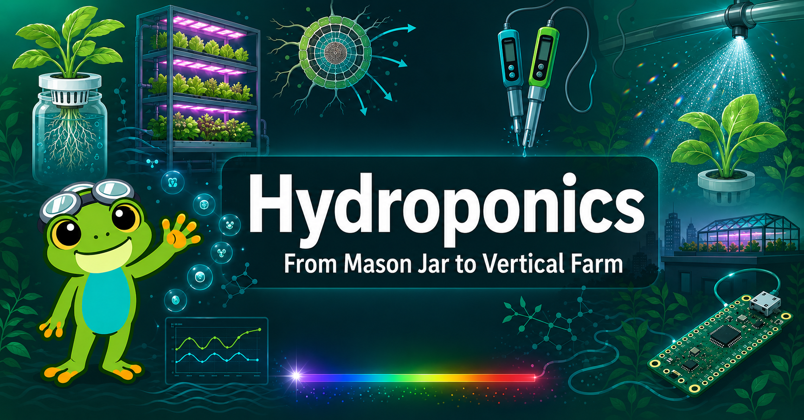

# Welcome

<figure markdown>
  { width="100%" }
</figure>

!!! mascot-welcome "Welcome, Hydro-Explorer!"
    
    Let's grow something amazing! Whether you're starting with a $10 mason jar on a windowsill
    or dreaming about a rooftop vertical farm, this book takes you from the first root hair
    all the way to a business plan. Root for it!

## About This Book

**Hydroponics: From Mason Jar to Vertical Farm** is an interactive intelligent textbook
for advanced high-school and college students. It bridges the gap between the plant
physiology and nutrient chemistry that make hydroponics *work* and the hands-on builds,
automation, and economics that make it *scale*.

The global vertical farming market exceeded $20 billion in 2026 — and the same science
that powers a rooftop commercial farm can be explored for as little as $10 with a mason
jar, a net pot, and some mineral salts. Every concept in this book is reinforced by
**MicroSims** — interactive browser-based simulations you can run without installing
anything.

## Who This Book Is For

- High-school and college students in biology, chemistry, or environmental science
- STEM hobbyists building their first DIY hydroponic system
- Makers and engineers adding automation (Raspberry Pi Pico, ESP32, MicroPython)
- Entrepreneurs exploring urban agriculture and vertical farming business models

**Prerequisites:** Basic biology (photosynthesis, cells), basic chemistry (pH, ions,
concentration), and comfort reading graphs. No prior hydroponics, electronics, or
programming experience required.

## What You Will Learn

| Theme | Topics |
|-------|--------|
| **Plant Science** | Root anatomy, nutrient uptake, water transport, photosynthesis |
| **Nutrient Chemistry** | pH, EC, macro- and micronutrients, Mulder's chart, solution mixing |
| **System Design** | Kratky, DWC, NFT, Ebb-and-Flow, Aeroponics — trade-offs and builds |
| **Automation & IoT** | Sensors, MicroPython, data logging, wireless dashboards |
| **Lighting & Environment** | PAR, PPFD, DLI, LED spectra, VPD, CO₂ |
| **Food Safety** | HACCP, biofilm, pathogens, sanitation protocols |
| **Scale & Economics** | Vertical farming, ROI modeling, sustainability, business planning |

## How to Use This Book

Use the **left sidebar** to navigate chapters, the learning graph, MicroSims, and
reference content.

- **[Chapters](chapters/index.md)** — 21 chapters from introduction through financial modeling,
  each with explanations, diagrams, and embedded MicroSims
- **[MicroSims](sims/index.md)** — 30+ interactive simulations covering nutrient mixing,
  system comparison, sensor dashboards, and more
- **[Learning Graph](learning-graph/index.md)** — visualize how all 500 concepts connect
  and depend on each other; explore before you read
- **[Course Description](course-description.md)** — the full scope, prerequisites, and
  Bloom's Taxonomy learning outcomes

## Getting Started

New to hydroponics? Start here:

1. [Chapter 1: Introduction](chapters/01-introduction/index.md) — history, why soilless growing works, and a field overview
2. [Chapter 2: Root Biology](chapters/02-root-biology/index.md) — the plant science that everything else builds on
3. [Chapter 6: Basic Hydroponic Systems](chapters/06-passive-basic-active-systems/index.md) — your first system choice

Ready to build? Jump to [Chapter 8: DIY & School Projects](chapters/08-diy-school-projects/index.md) for a $10–$50 starter build.

Want to automate? See [Chapter 12: MicroPython Fundamentals](chapters/12-micropython-fundamentals/index.md).

Thinking commercial? [Chapter 20: Vertical Farming](chapters/20-vertical-farming/index.md) and [Chapter 21: Financial Modeling](chapters/21-financial-modeling/index.md) lay out the economics.
