# List of MicroSims for Hydroponics

Interactive Micro Simulations to help students learn hydroponics fundamentals — from plant biology and nutrient chemistry to system design and data analysis.

-   **[Biomass Growth Tracker](./biomass-growth-tracker/index.md)**

    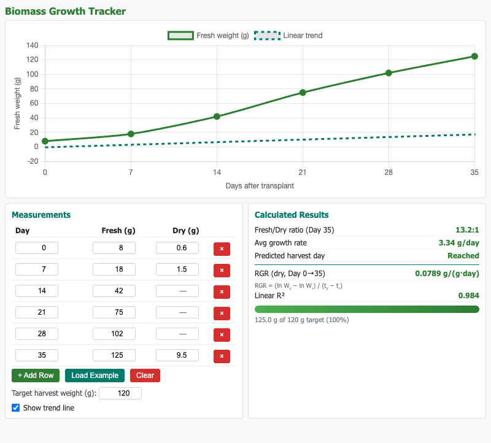

    Enter plant growth measurements to plot growth curves and calculate relative growth rate and fresh-to-dry weight ratio over a simulated crop cycle.

-   **[Commercial Vertical Farm Comparison](./vertical-farm-comparison/index.md)**

    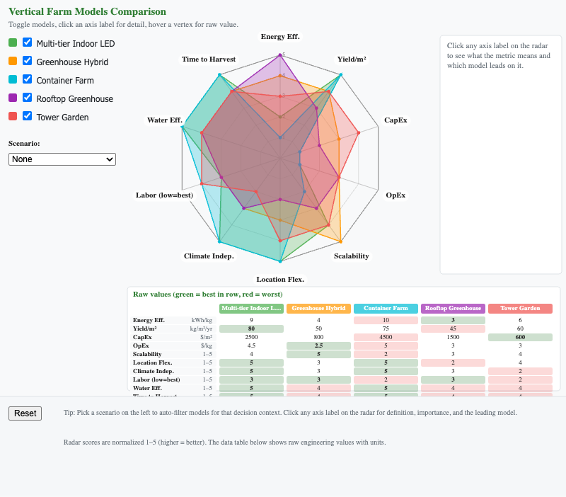

    Radar chart comparing five vertical farming models across 10 dimensions including energy efficiency, yield per floor area, CapEx, and location flexibility.

-   **[DIY Build Cost and Complexity Selector](./diy-build-selector/index.md)**

    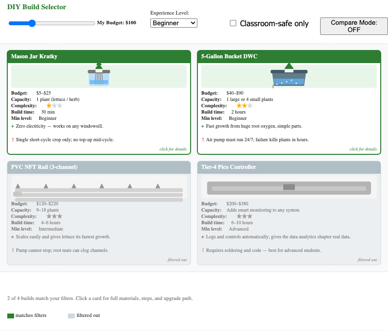

    Filter four DIY hydroponic builds by budget and experience level to find the best starting project, with component lists and safety ratings for each.

-   **[EC and pH Monitor Over a Crop Cycle](./ec-ph-monitor/index.md)**

    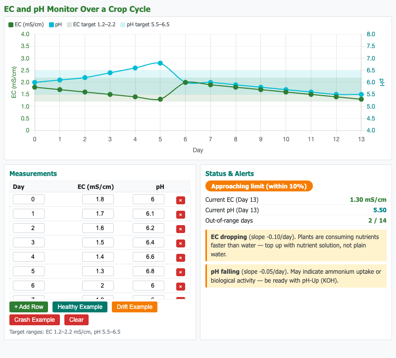

    Dual-axis chart showing how EC and pH evolve over a 35-day crop cycle with interactive management actions like topping up water and adding pH adjusters.

-   **[Failure Mode Analysis Decision Tree](./failure-mode-analysis/index.md)**

    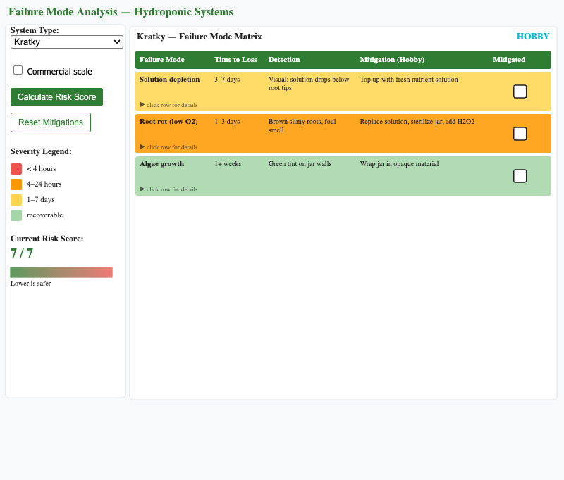

    Color-coded failure mode matrix for six hydroponic system types, showing time-to-crop-loss, detection method, and recommended mitigation for each failure.

-   **[Growing Media Properties Comparison](./growing-media-comparison/index.md)**

    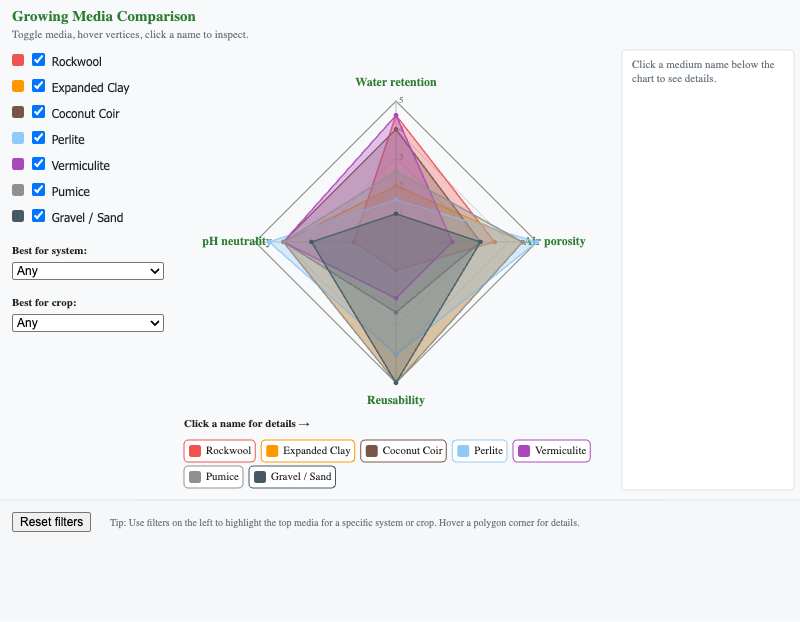

    Radar chart comparing seven growing media across water retention, air porosity, reusability, and pH neutrality with filters by system type and crop.

-   **[HACCP Food Safety Risk Matrix](./haccp-risk-matrix/index.md)**

    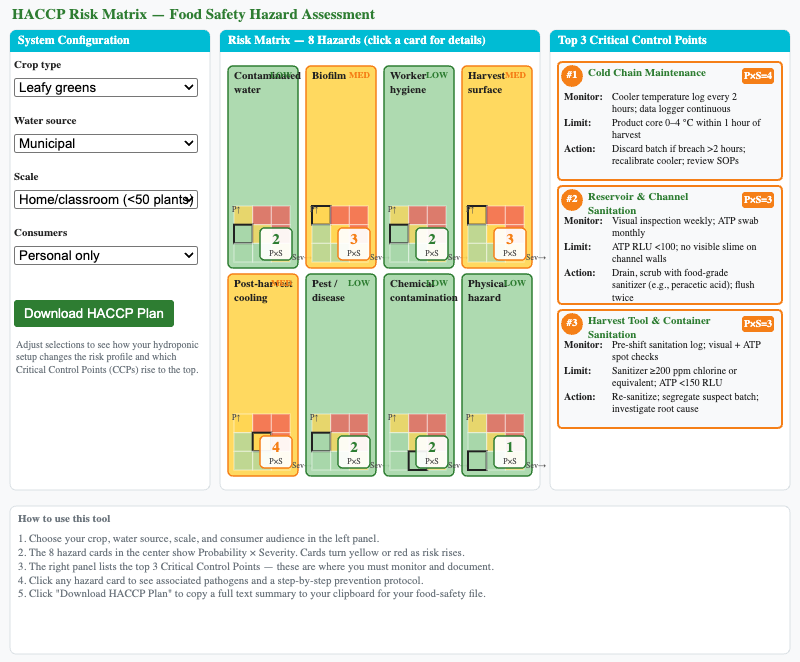

    Identify Critical Control Points and corrective actions for your hydroponic setup by selecting crop type, water source, scale, and consumer group.

-   **[Hardware Interface Architecture](./hardware-interface-architecture/index.md)**

    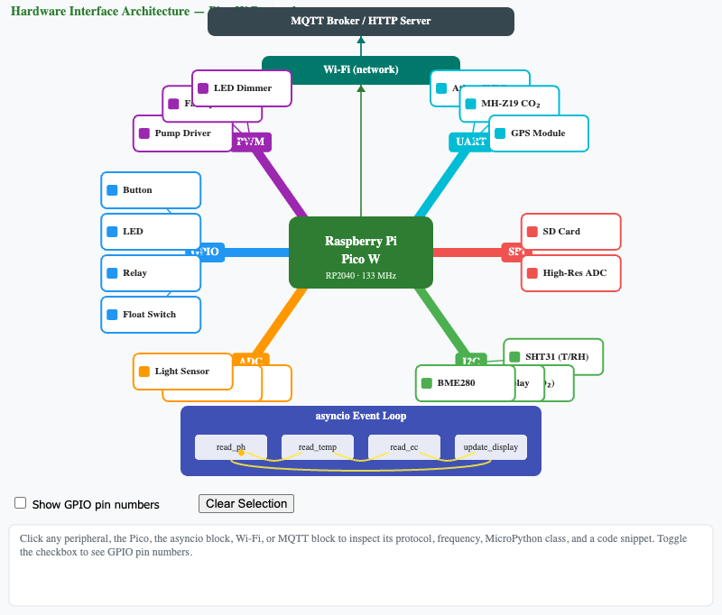

    Architecture diagram showing how GPIO, ADC, PWM, I2C, SPI, and UART protocols connect a Raspberry Pi Pico W to hydroponic sensors and actuators.

-   **[History of Hydroponics Timeline](./hydroponics-history-timeline/index.md)**

    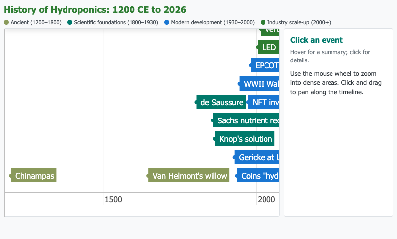

    Scrollable timeline from 1200 CE to today with clickable milestones tracing the history of soilless growing from Aztec chinampas to modern hydroponics.

-   **[Hydroponic Farm Financial Model Builder](./farm-financial-model/index.md)**

    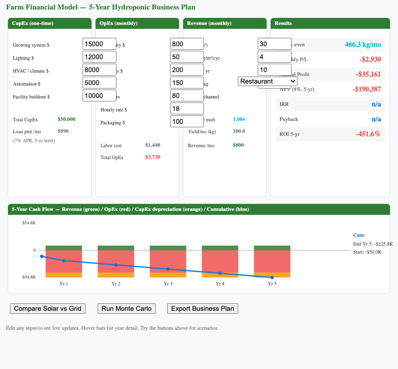

    Enter CapEx, OpEx, and revenue inputs to calculate break-even, NPV, IRR, payback period, and a 5-year cash flow chart for a hydroponic operation.

-   **[Hydroponic Systems Side-by-Side Comparison](./hydroponic-systems-comparison/index.md)**

    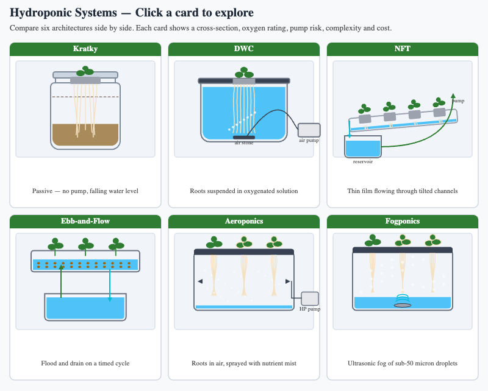

    Clickable gallery of six hydroponic system cross-sections (Kratky, DWC, NFT, Ebb-and-Flow, Aeroponics, Drip) with trade-off comparisons on five dimensions.

-   **[Indoor Grow Room Layout](./indoor-grow-room-layout/index.md)**

    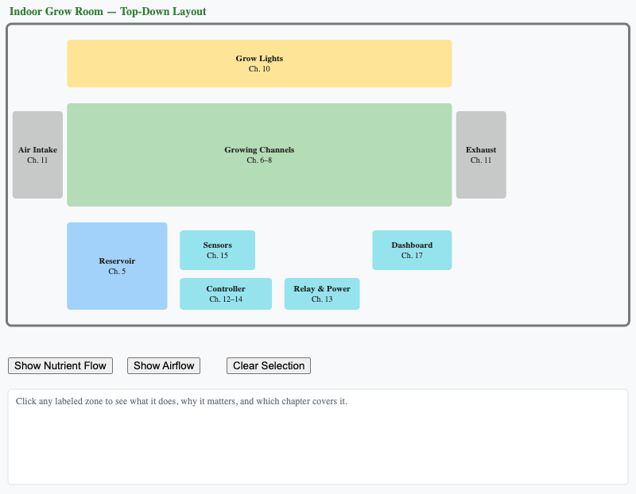

    Bird's-eye view of a grow room with clickable zones identifying each component and linking to the chapters that cover it in depth.

-   **[Interactive Mulder's Chart — pH and Nutrient Availability](./mulders-chart-interactive/index.md)**

    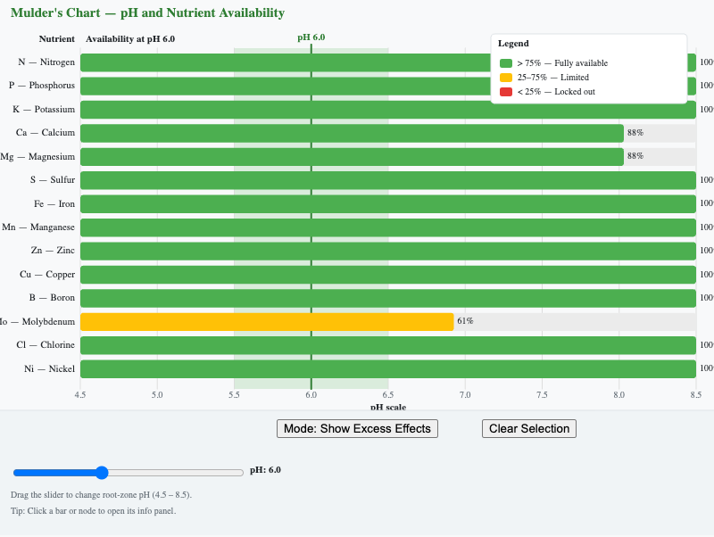

    Drag a pH slider to see how each of 14 mineral nutrients changes in availability and visualize Mulder antagonism relationships between nutrients.

-   **[Ion Uptake Mechanisms Comparison](./ion-uptake-mechanisms/index.md)**

    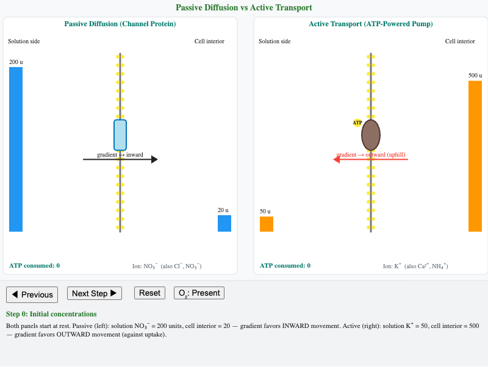

    Step-through side-by-side comparison of passive diffusion and active transport with concrete concentration values and ATP consumption at each stage.

-   **[IoT Data Flow Architecture](./iot-data-flow/index.md)**

    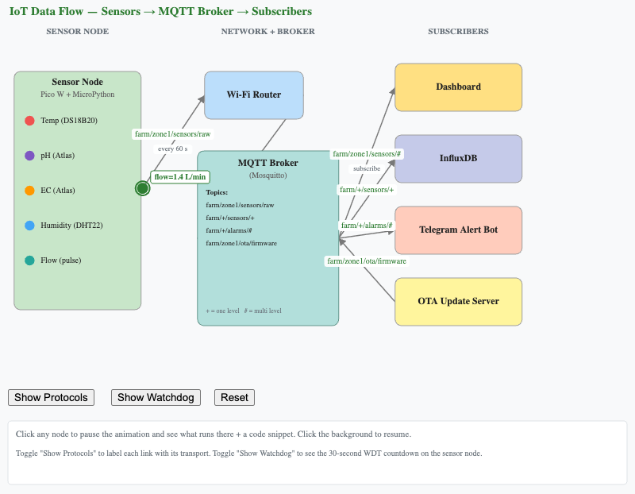

    Architecture diagram tracing sensor data from a Pico W through Wi-Fi to an MQTT broker and out to dashboards, databases, alert bots, and OTA update server.

-   **[Learning Graph Viewer](./graph-viewer/index.md)**

    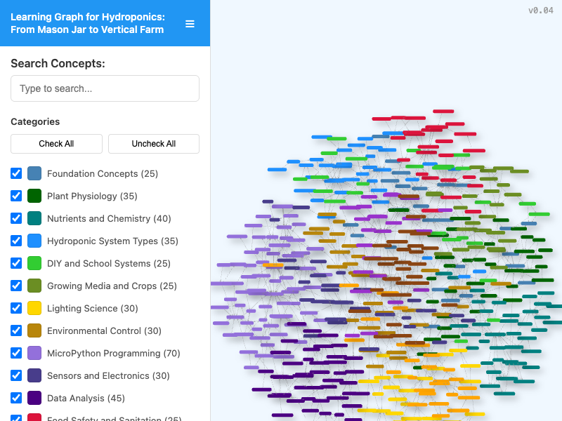

    Interactive network graph of all course concepts with search, category filtering, and click-to-expand navigation showing concept dependencies.

-   **[MicroPython Concept Map](./micropython-concept-map/index.md)**

    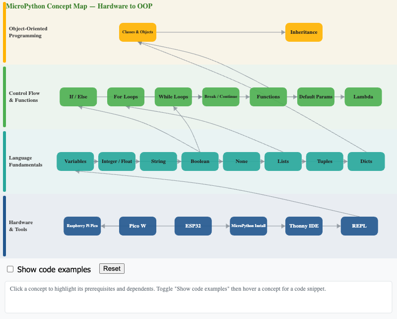

    Four-tier dependency map showing how 25 MicroPython concepts build from hardware setup through language fundamentals to object-oriented programming.

-   **[Nutrient Deficiency Visual Diagnostic Tool](./nutrient-deficiency-visual-diagnostic/index.md)**

    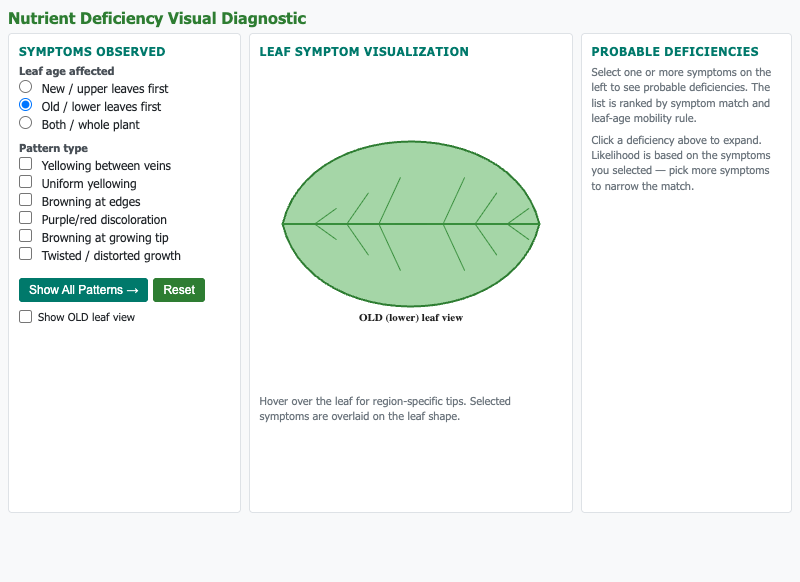

    Select leaf symptoms (yellowing, browning, distortion) to identify nutrient deficiencies with a leaf illustration that updates based on mobility rules.

-   **[Nutrient Solution Mixing Calculator](./nutrient-solution-mixer/index.md)**

    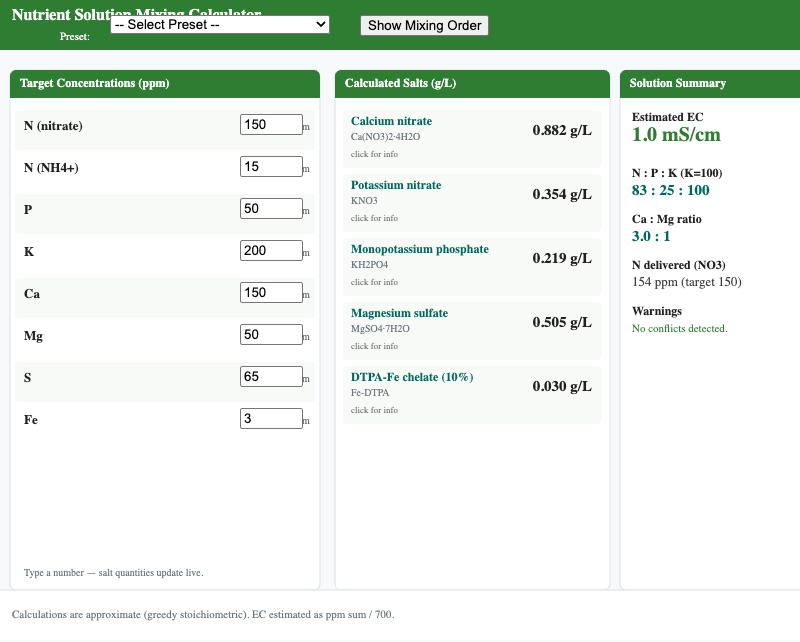

    Enter target element concentrations in ppm to calculate the salt quantities needed with EC estimation, N:P:K ratio, and co-precipitation warnings.

-   **[Photosynthesis and Respiration Cycle](./photosynthesis-respiration-cycle/index.md)**

    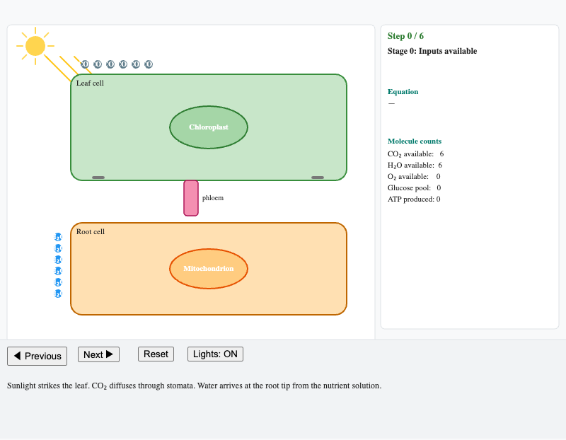

    Step-through visualization of photosynthesis and cellular respiration showing inputs, outputs, molecule counts, and energy flow between chloroplast and mitochondrion.

-   **[Plant Life Cycle Stages Explorer](./plant-life-cycle-explorer/index.md)**

    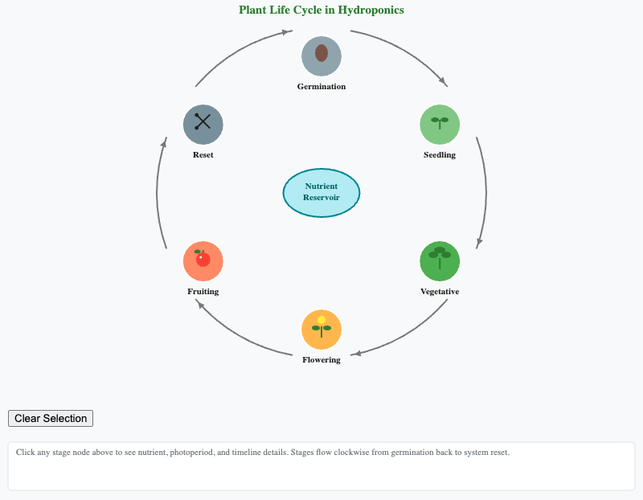

    Circular diagram of six plant life stages with clickable nodes revealing nutrient, light, temperature, and timing requirements for each stage.

-   **[PPFD and DLI Calculator](./ppfd-dli-calculator/index.md)**

    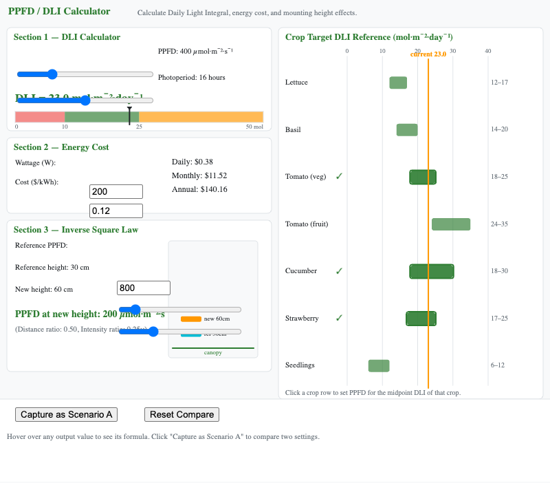

    Calculate DLI from PPFD and photoperiod, compare lighting energy costs at your electricity rate, and see how fixture mounting height affects PPFD.

-   **[Root Cross-Section and Absorption Zones](./root-anatomy-explorer/index.md)**

    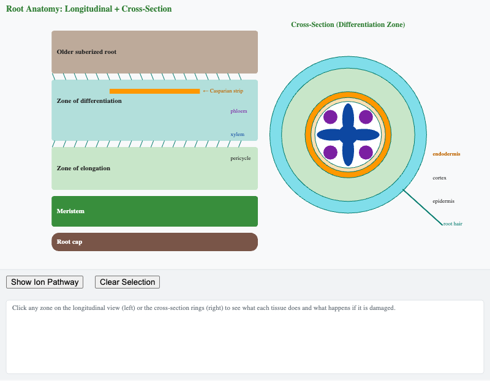

    Clickable longitudinal root cross-section showing five zones from root cap to mature tissue with a lateral cross-section revealing vascular structure.

-   **[Root Exudate pH Drift Simulator](./root-exudate-ph-drift/index.md)**

    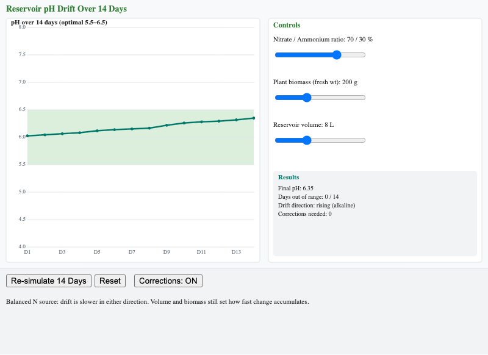

    Simulate reservoir pH drift over 14 days by adjusting the nitrate-to-ammonium ratio to see how nitrogen source affects pH direction and rate of change.

-   **[Sensor Data Analysis Pipeline](./sensor-data-pipeline/index.md)**

    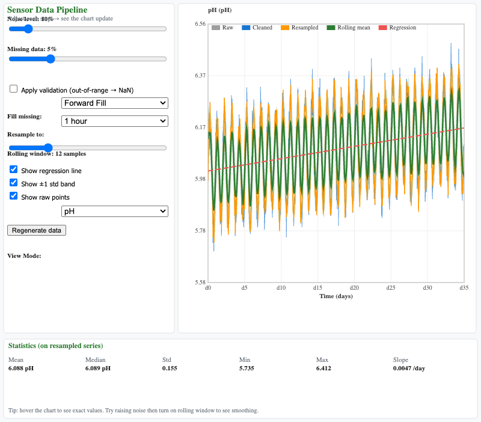

    Apply data analysis steps (noise, validation, fill, resample, rolling average) to a simulated 35-day crop cycle dataset and observe real-time transformations.

-   **[Sensor Node Architecture](./sensor-node-architecture/index.md)**

    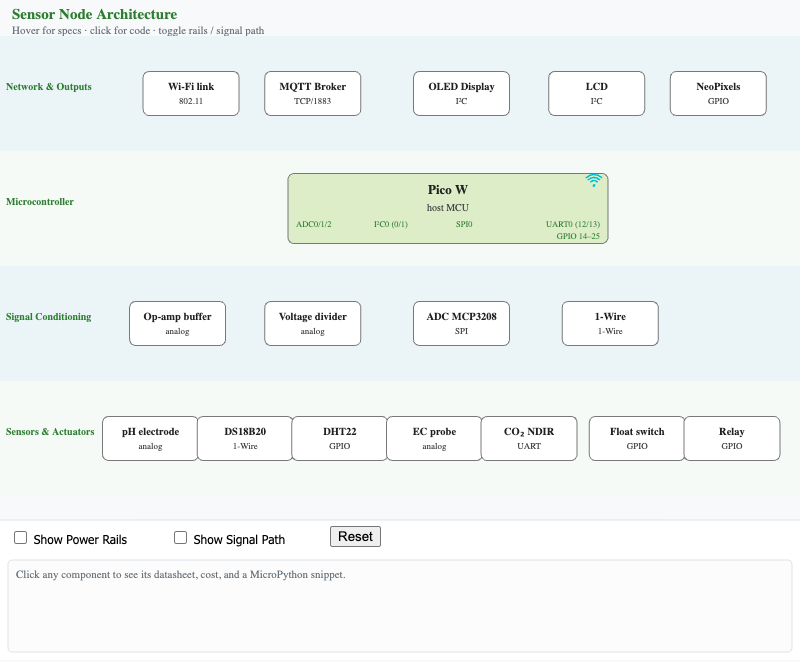

    Four-layer hardware diagram showing sensors, signal conditioning, Pico W microcontroller, and network output with power supply rails (3.3V, 5V, 12V, GND).

-   **[Solar Power System Designer](./solar-power-designer/index.md)**

    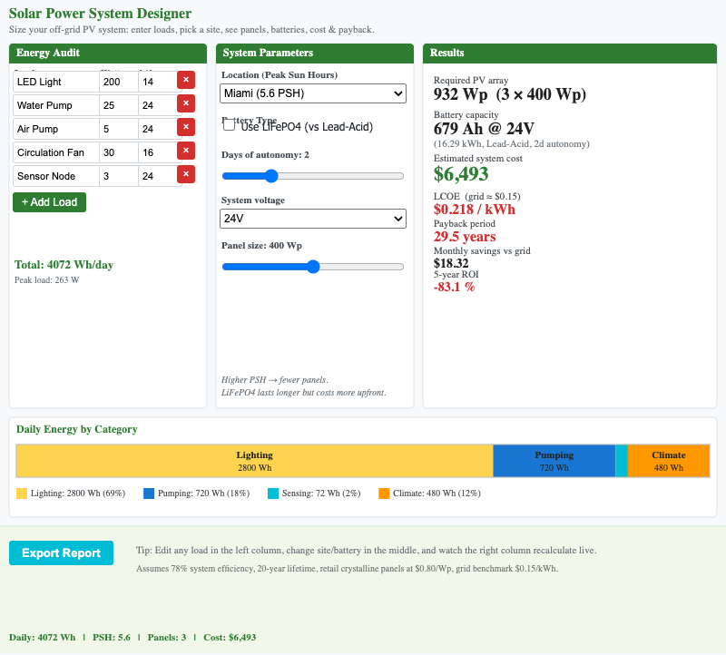

    Design a solar power system by entering energy loads and location to calculate panel count, battery size, total cost, and levelized cost of energy (LCOE).

-   **[SPC Dashboard for Hydroponics](./spc-dashboard/index.md)**

    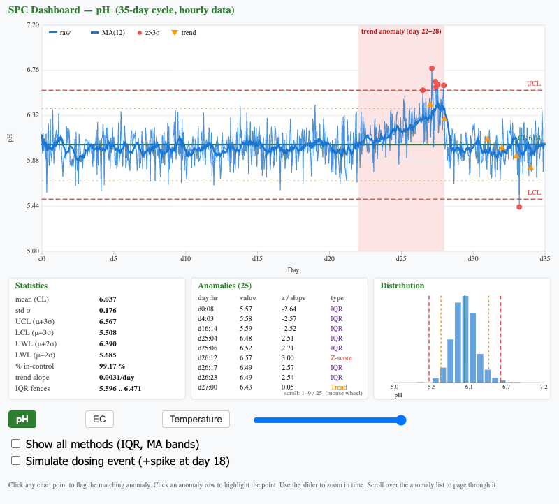

    Statistical Process Control dashboard for a 35-day crop cycle with control charts, anomaly flags, and trend analysis for pH, EC, and temperature.

-   **[System Selection Decision Tree](./system-selection-decision-tree/index.md)**

    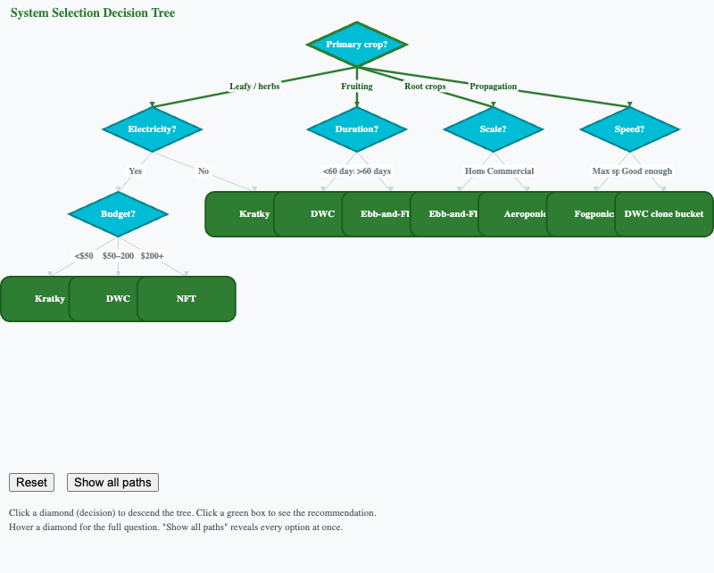

    Clickable decision flowchart guiding students through crop type, budget, and electricity availability to recommend the most suitable hydroponic system.

-   **[VPD and Environmental Parameter Dashboard](./vpd-environment-dashboard/index.md)**

    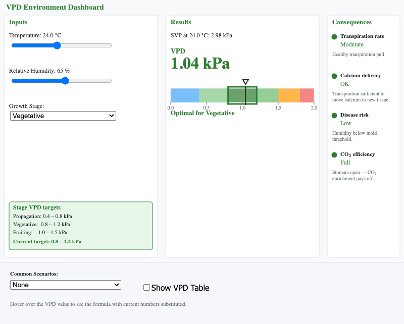

    Set temperature and humidity sliders to calculate Vapor Pressure Deficit in real time with color-coded feedback for propagation, vegetative, and fruiting stages.

